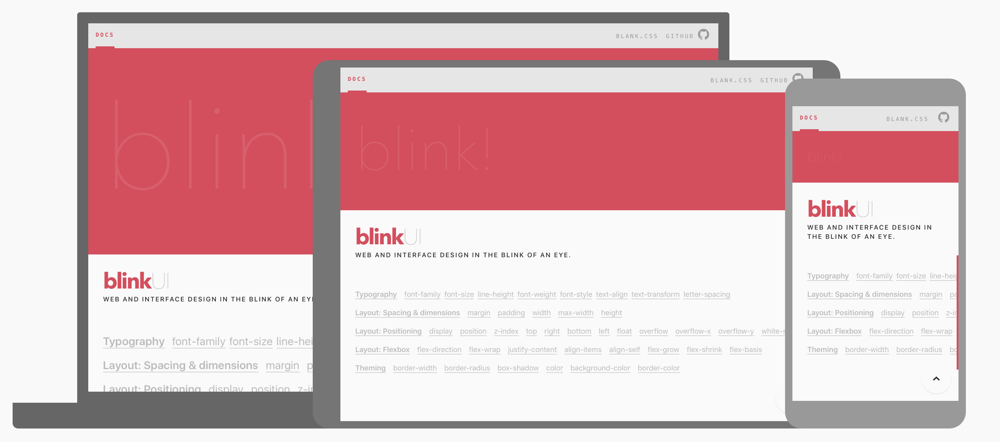

# blinkUI.github.io

Documentation site for **blink UI** — web and interface design in the blink of an eye.

[blinkUI.github.io](https://blinkui.github.io)



*Work in progress!*


---

We suggest using `blank.css` as a reset stylesheet. It is included in the “css” folder.

If you should not want to use blank.css, the following css will get you started (most important here are `box-sizing` and `border-style`):

```css
html {
    box-sizing: border-box;
    font-size: 1rem;
    line-height: 1.5;
    font-family: -apple-system, BlinkMacSystemFont, "Segoe UI", "Roboto", "Helvetica Neue", sans-serif;
    border-width: 0;
    border-style: solid;
    height: 100%;
}

*, *::before, *::after {
    box-sizing: inherit;
    margin: 0;
    padding: 0;
    border-width: 0;
    border-radius: 0;
    border-style: inherit;
    outline: 0;
    font-family: inherit;
    font-size: inherit;
    line-height: inherit;
    vertical-align: baseline;
    color: currentColor;
    background-color: transparent;
    background-repeat: no-repeat;
}

body {
    min-height: 100%;
    font-size: 100%;
    margin: 0;
}

img, video, audio, iframe {
    max-width: 100%;
    height: auto;
}
```

---

## Notes:

### Up for discussion:

- text-decoration
- vertical-align
- writing-mode
- column-count (R)
- hyphens
- list-style
- background-blend-mode
- negative margins
- cursor (pointer)

### Thoughts:

- Check :a and :f consistency (bgc,bc,c)
- :h only modules: box-shadow
- Steps (8, 16) also in `z-index` and `top`, `right`… modules? (Consistency)

## Add:

- width, max-width and height should have responsive classes (at least vh + %/vw)
- max-width should contain breakpoint widths e.g. .mw-md {max-width: --var(breakpoint-md)}
- `padding_child.css` (then, margin und padding need !important)
- separate section for “add-ons/helpers” (like `margin_child.css`)
- add responsive classes to `order.css`

## Make responsive?:

- `flex-grow`
- `z-index`

## Demo:

- `margin_child.css`
- `order.css`

## Exceptions:

- `bgc` (background-color) vs. `bc` (border-color)
- font-weight: normal (`fw-n`) vs. flex-wrap: nowrap (`fw-nw` also: `ws-nw`)

## Attention:

- `fs`: flex-shrink, font-size, font-style
- `fw`: font-weight, flex-wrap
- `o`: order, opacity

---

## Breakpoint template

```css
@media screen and (min-width: 40rem) {}

@media screen and (min-width: 60rem) {}

@media screen and (min-width: 80rem) {}
```

---

The MIT License (MIT)

Copyright 2016 – 2017 Damian Gerbaulet

Permission is hereby granted, free of charge, to any person obtaining a copy of this software and associated documentation files (the "Software"), to deal in the Software without restriction, including without limitation the rights to use, copy, modify, merge, publish, distribute, sublicense, and/or sell copies of the Software, and to permit persons to whom the Software is furnished to do so, subject to the following conditions:

The above copyright notice and this permission notice shall be included in all copies or substantial portions of the Software.

THE SOFTWARE IS PROVIDED "AS IS", WITHOUT WARRANTY OF ANY KIND, EXPRESS OR IMPLIED, INCLUDING BUT NOT LIMITED TO THE WARRANTIES OF MERCHANTABILITY, FITNESS FOR A PARTICULAR PURPOSE AND NON-INFRINGEMENT. IN NO EVENT SHALL THE AUTHORS OR COPYRIGHT HOLDERS BE LIABLE FOR ANY CLAIM, DAMAGES OR OTHER LIABILITY, WHETHER IN AN ACTION OF CONTRACT, TORT OR OTHERWISE, ARISING FROM, OUT OF OR IN CONNECTION WITH THE SOFTWARE OR THE USE OR OTHER DEALINGS IN THE SOFTWARE.
